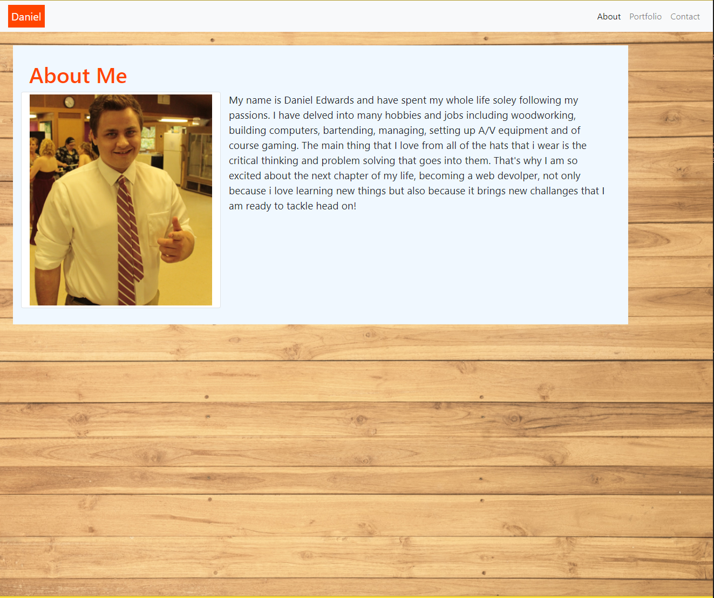
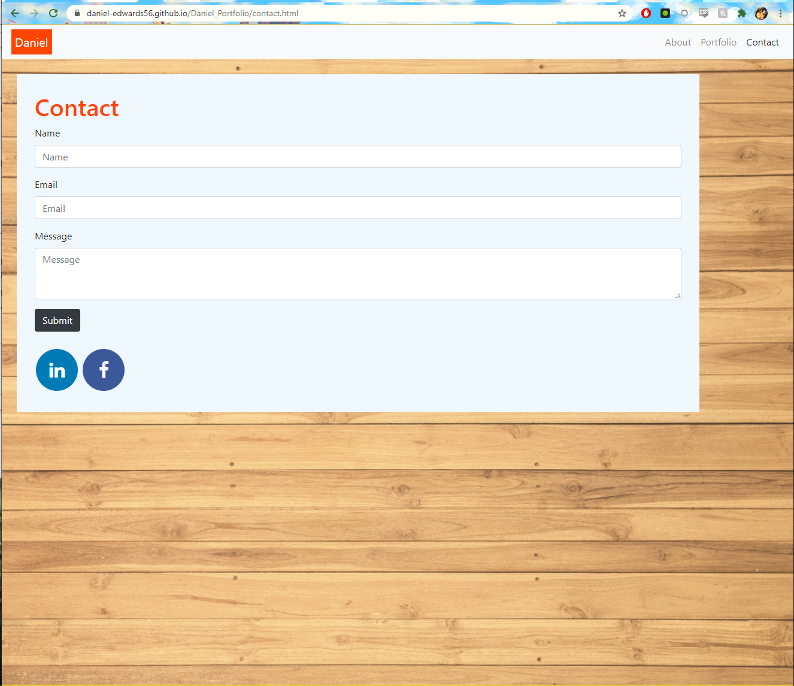
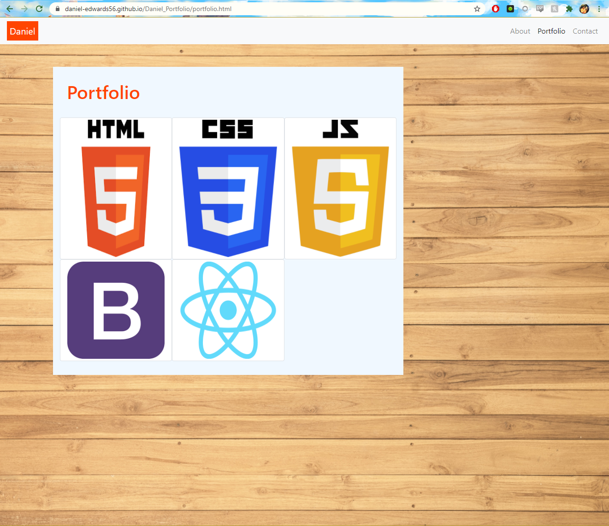

# Daniel_Portfolio

link to deployed site: https://daniel-edwards56.github.io/Daniel_Portfolio/
 
In this project I made a webpage that serves as a description about me with a photo, a porfolio that I will fill with future projects and a way to get in contact with me including social meadia. Each page is linked together with a navbar using bootsrap and each page is also made responsive with bootstrap.
 

 

 

